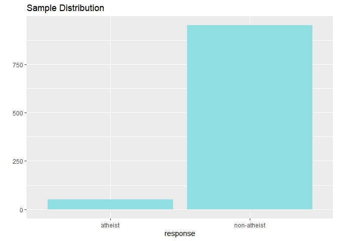
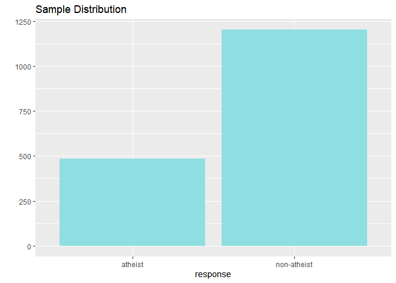
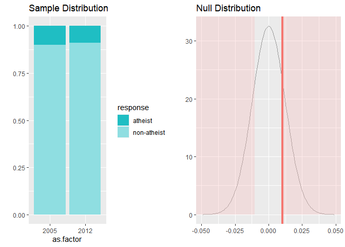
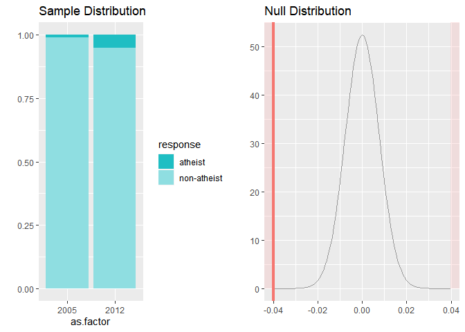

Inference for categorical data
================

<div class="instructions">

Complete all **Exercises**, and submit answers to **Questions** on the
Coursera platform.

</div>

## Introduction

In August of 2012, news outlets ranging from the [Washington
Post](http://www.washingtonpost.com/national/on-faith/poll-shows-atheism-on-the-rise-in-the-us/2012/08/13/90020fd6-e57d-11e1-9739-eef99c5fb285_story.html)
to the [Huffington
Post](http://www.huffingtonpost.com/2012/08/14/atheism-rise-religiosity-decline-in-america_n_1777031.html)
ran a story about the rise of atheism in America. The source for the
story was a poll that asked people, “Irrespective of whether you attend
a place of worship or not, would you say you are a religious person, not
a religious person or a convinced atheist?” This type of question, which
asks people to classify themselves in one way or another, is common in
polling and generates categorical data. In this lab we take a look at
the atheism survey and explore what’s at play when making inference
about population proportions using categorical data.

## Getting Started

### Load packages

In this lab we will explore the data using the `dplyr` package and
visualize it using the `ggplot2` package for data visualization. The
data can be found in the companion package for this course, `statsr`.

Let’s load the packages.

``` r
library(statsr)
library(dplyr)
library(ggplot2)
```

### The survey

The press release for the poll, conducted by WIN-Gallup International,
can be accessed
[here](http://www.wingia.com/web/files/richeditor/filemanager/Global_INDEX_of_Religiosity_and_Atheism_PR__6.pdf).

Take a moment to review the report then address the following questions.

<div class="question">

How many people were interviewed for this survey?

-   A poll conducted by WIN-Gallup International surveyed 51,000 people
    from 57 countries.
-   A poll conducted by WIN-Gallup International surveyed 52,000 people
    from 57 countries.
-   A poll conducted by WIN-Gallup International surveyed 51,917 people
    from 57 countries.
-   A poll conducted by WIN-Gallup International surveyed 51,927 people
    from 57 countries.

</div>

**A poll conducted by WIN-Gallup International surveyed 51,927 people
from 57 countries.**

<div class="question">

Which of the following methods were used to gather information?

-   Face to face  
-   Telephone
-   Internet  
-   All of the above

</div>

**All of the above**

<div class="question">

True / False: In the first paragraph, several key findings are reported.
These percentages appear to be **sample statistics**.

-   True  
-   False

</div>

**TRUE**

<div class="question">

True / False:The title of the report is “Global Index of Religiosity and
Atheism”. To generalize the report’s findings to the global human
population, We must assume that the sample was a random sample from the
entire population in order to be able to generalize the results to the
global human population. This seems to be a reasonable assumption.

-   True  
-   False

</div>

**FALSE**

Turn your attention to Table 6 (pages 15 and 16), which reports the
sample size and response percentages for all 57 countries. While this is
a useful format to summarize the data, we will base our analysis on the
original data set of individual responses to the survey. Load this data
set into R with the following command.

``` r
data(atheism)
```

<div class="question">

What does each row of Table 6 correspond to?

-   Countries  
-   Individual Persons  
-   Religions

</div>

**Countries**

<div class="question">

What does each row of `atheism` correspond to?

-   Countries  
-   Individual Persons  
-   Religions

</div>

**Individual Persons**

To investigate the link between these two ways of organizing this data,
take a look at the estimated proportion of atheists in the United
States. Towards the bottom of Table 6, we see that this is 5%. We should
be able to come to the same number using the `atheism` data.

Create a new dataframe called `us12` that contains only the rows in
`atheism` associated with respondents to the 2012 survey from the United
States:

``` r
us12 <- atheism %>%
  filter(nationality == "United States" , atheism$year == "2012")
```

<div class="question">

Next, calculate the proportion of atheist responses in the United States
in 2012, i.e. in `us12`. True / False: This percentage agrees with the
percentage in Table\~6.

-   True  
-   False

**TRUE**

</div>

``` r
# type your code for Question 7 here, and Knit
library(flextable)
set_flextable_defaults(
  font.size = 10, theme_fun = theme_vanilla,
  padding = 6,
  font.family = "sans",
  background.color = "#EFEFEF",
  font.color = "black")
us12 %>% 
  count(response,name = "count",sort = TRUE) %>%
  mutate(proportion = (count/sum(count))) %>% 
  flextable()
```

## Inference on proportions

As was hinted earlier, Table 6 provides **sample statistics**, that is,
calculations made from the sample of 51,927 people. What we’d like,
though, is insight into the population **population parameters**. You
answer the question, “What proportion of people in your sample reported
being atheists?” with a statistic; while the question “What proportion
of people on earth would report being atheists” is answered with an
estimate of the parameter.

The inferential tools for estimating population proportion are analogous
to those used for means in the last lab: the confidence interval and the
hypothesis test.

<div class="exercise">

Write out the conditions for inference to construct a 95% confidence
interval for the proportion of atheists in the United States in 2012.
Are you confident all conditions are met?

–The sample observations are independent - we can be certain this
condition is met since the sample size of 1002 for the US is definitely
less than 10% of the U.S. population. We assume that the samples are
randomly selected. –The success-failure conditons requirs np &gt;= 10
and n(1-p)&gt;=10. np = 1002*0.05 = 50, n(1-p)=1002*0.95 = 952 so this
condition is met.

</div>

If the conditions for inference are reasonable, we can either calculate
the standard error and construct the interval by hand, or allow the
`inference` function to do it for us.

``` r
inference(response, data=us12, statistic =   "proportion", type = "ci",
          method = "theoretical", success = "atheist")
```

    ## Single categorical variable, success: atheist
    ## n = 1002, p-hat = 0.0499
    ## 95% CI: (0.0364 , 0.0634)

<!-- -->

``` r
p_hat<- 0.0499
```

Note that since the goal is to construct an interval estimate for a
proportion, it’s necessary to specify what constitutes a
\``success'', which here is a response of`atheist\`.

Although formal confidence intervals and hypothesis tests don’t show up
in the report, suggestions of inference appear at the bottom of page 7:
“In general, the error margin for surveys of this kind is ± 3-5% at 95%
confidence.”

<div class="exercise">

Imagine that, after reading a front page story about the latest public
opinion poll, a family member asks you, “What is a margin of error?” In
one sentence, and ignoring the mechanics behind the calculation, how
would you respond in a way that conveys the general concept?

</div>

<div class="question">

Based on the R output, what is the margin of error for the estimate of
the proportion of the proportion of atheists in US in 2012?

-   The margin of error for the estimate of the proportion of atheists
    in the US in 2012 is 0.05.  
-   The margin of error for the estimate of the proportion of atheists
    in the US in 2012 is 0.025.  
-   The margin of error for the estimate of the proportion of atheists
    in the US in 2012 is 0.0135.

</div>

``` r
# type your code for Question 8 here, and Knit
n<- nrow(us12)
SE<- sqrt(p_hat*(1-p_hat)/n)
z_star<- qnorm(.025, lower.tail = FALSE)
ME<-z_star*SE
ME
```

    ## [1] 0.01348184

<div class="exercise">

Using the inference function, calculate confidence intervals for the
proportion of atheists in 2012 in two other countries of your choice,
and report the associated margins of error. Be sure to note whether the
conditions for inference are met. It may be helpful to create new data
sets for each of the two countries first, and then use these data sets
in the `inference` function to construct the confidence intervals.

</div>

``` r
# type your code for the Exercise here, and Knit
france12<- atheism %>% filter(nationality == "France", year == "2012")

tabf<-table(france12$response)

tabf
```

    ## 
    ##     atheist non-atheist 
    ##         485        1203

``` r
p_hatf<- tabf[[1]]/nrow(france12)

p_hatf
```

    ## [1] 0.2873223

``` r
inference(y = response, data = france12, statistic = "proportion",type = "ci",method = "theoretical", success = "atheist")
```

    ## Single categorical variable, success: atheist
    ## n = 1688, p-hat = 0.2873
    ## 95% CI: (0.2657 , 0.3089)

<!-- -->

``` r
n_f<- nrow(france12)

n_f
```

    ## [1] 1688

``` r
SE_f<- sqrt(p_hatf*(1-p_hatf)/n_f)

SE_f
```

    ## [1] 0.011014

``` r
z_star_f<- qnorm(.025,lower.tail = FALSE)

z_star_f
```

    ## [1] 1.959964

``` r
ME_f<- z_star_f*SE_f

ME_f
```

    ## [1] 0.02158704

## How does the proportion affect the margin of error?

Imagine you’ve set out to survey 1000 people on two questions: are you
female? and are you left-handed? Since both of these sample proportions
were calculated from the same sample size, they should have the same
margin of error, right? Wrong! While the margin of error does change
with sample size, it is also affected by the proportion.

Think back to the formula for the standard error:
$SE = \\sqrt{p(1-p)/n}$. This is then used in the formula for the margin
of error for a 95% confidence interval:
$ME = 1.96\\times SE = 1.96\\times\\sqrt{p(1-p)/n}$. Since the
population proportion *p* is in this *M**E* formula, it should make
sense that the margin of error is in some way dependent on the
population proportion. We can visualize this relationship by creating a
plot of *M**E* vs. *p*.

The first step is to make a vector `p` that is a sequence from 0 to 1
with each number separated by 0.01. We can then create a vector of the
margin of error (`me`) associated with each of these values of `p` using
the familiar approximate formula (*M**E* = 1.96 × *S**E*). Lastly, we
plot the two vectors against each other to reveal their relationship.

``` r
d <- data.frame(p <- seq(0, 1, 0.01))
n <- 1000
d <- d %>%
  mutate(me = 1.96*sqrt(p*(1 - p)/n))
ggplot(d, aes(x = p, y = me)) +
  geom_line()
```

<!-- -->

<div class="question">

Which of the following is false about the relationship between *p* and
*M**E*.

-   The *M**E* reaches a minimum at *p* = 0.  
-   The *M**E* reaches a minimum at *p* = 1.  
-   The *M**E* is maximized when *p* = 0.5.  
-   The most conservative estimate when calculating a confidence
    interval occurs when *p* is set to 1.

</div>

The question of atheism was asked by WIN-Gallup International in a
similar survey that was conducted in 2005. We assume here that sample
sizes have remained the same. Table 4 on page 13 of the report
summarizes survey results from 2005 and 2012 for 39 countries.

Answer the following two questions using the `inference` function. As
always, write out the hypotheses for any tests you conduct and outline
the status of the conditions for inference.

<div class="question">

True / False: There is convincing evidence that Spain has seen a change
in its atheism index between 2005 and 2012. <br><br> *Hint:* Create a
new data set for respondents from Spain. Then use their responses as the
first input on the `inference`, and use `year` as the grouping variable.

-   True  
-   False

</div>

``` r
# type your code for Question 10 here, and Knit
spain<- atheism %>% filter(nationality == "Spain")

inference(y = response , x = as.factor (year),  data = spain, type = "ht", statistic = "proportion", null = 0, alternative = "twosided", method  =  "theoretical" , success = "atheist")
```

    ## Response variable: categorical (2 levels, success: atheist)
    ## Explanatory variable: categorical (2 levels) 
    ## n_2005 = 1146, p_hat_2005 = 0.1003
    ## n_2012 = 1145, p_hat_2012 = 0.09
    ## H0: p_2005 =  p_2012
    ## HA: p_2005 != p_2012
    ## z = 0.8476
    ## p_value = 0.3966

<!-- -->

<div class="question">

True / False: There is convincing evidence that the United States has
seen a change in its atheism index between 2005 and 2012.

-   True  
-   False

\#\#TRUE

</div>

``` r
# type your code for Question 11 here, and Knit
us<- atheism %>% filter(nationality == "United States")

inference(y = response, x = as.factor(year), data = us, statistic = "proportion", type = "ht", null = 0, alternative = "twosided", success = "atheist", method = "theoretical")
```

    ## Response variable: categorical (2 levels, success: atheist)
    ## Explanatory variable: categorical (2 levels) 
    ## n_2005 = 1002, p_hat_2005 = 0.01
    ## n_2012 = 1002, p_hat_2012 = 0.0499
    ## H0: p_2005 =  p_2012
    ## HA: p_2005 != p_2012
    ## z = -5.2431
    ## p_value = < 0.0001

<!-- -->

<div class="question">

If in fact there has been no change in the atheism index in the
countries listed in Table 4, in how many of those countries would you
expect to detect a change (at a significance level of 0.05) simply by
chance? <br><br> *Hint:* Type 1 error.

-   0
-   1  
-   1.95  
-   5

</div>

There are 39 countries in table 4 and significance level is .05 . Type 1
error is rejecting null hypothesis H0 when it is actually true. so
according to given significance level we can incorrectly reject H0 not
more than 5%.

``` r
# type your code for Question 12 here, and Knit
39*.05
```

    ## [1] 1.95

<div class="question">

Suppose you’re hired by the local government to estimate the proportion
of residents that attend a religious service on a weekly basis.
According to the guidelines, the estimate must have a margin of error no
greater than 1% with 95% confidence. You have no idea what to expect for
*p*. How many people would you have to sample to ensure that you are
within the guidelines? <br><br> *Hint:* Refer to your plot of the
relationship between *p* and margin of error. Do not use the data set to
answer this question.

-   2401 people
-   At least 2401 people
-   9604 people  
-   At least 9604 people

</div>

``` r
# type your code for Question 13 here, and Knit
people<- (.5*(1-.5)*1.96^2)/.01^2

people
```

    ## [1] 9604

\#\#At least 9604 people

<div id="license">

This is a product of OpenIntro that is released under a [Creative
Commons Attribution-ShareAlike 3.0
Unported](http://creativecommons.org/licenses/by-sa/3.0). This lab was
written for OpenIntro by Andrew Bray and Mine Çetinkaya-Rundel.

</div>
